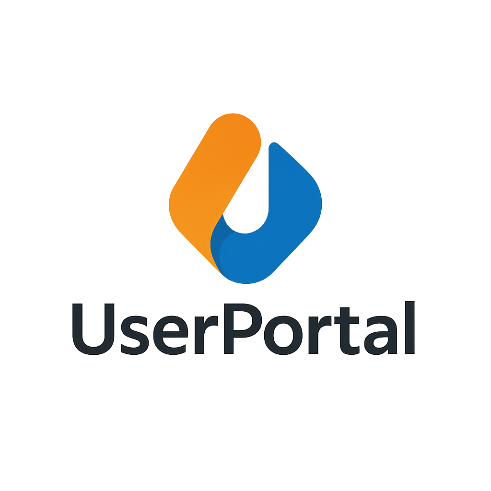
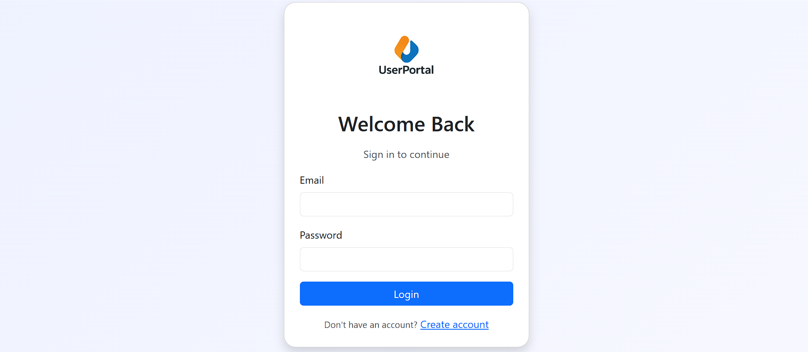
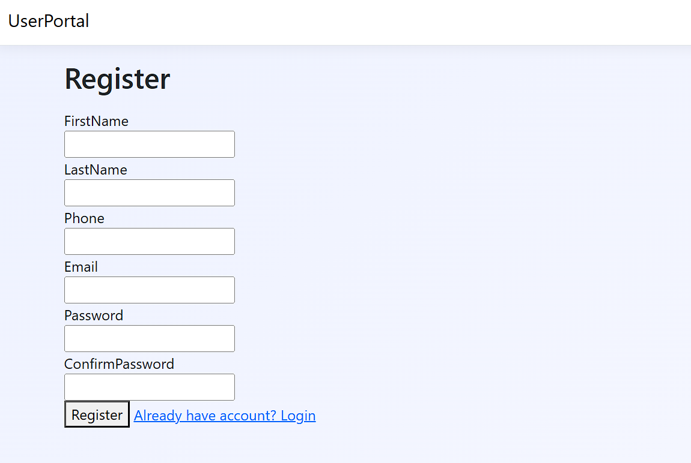
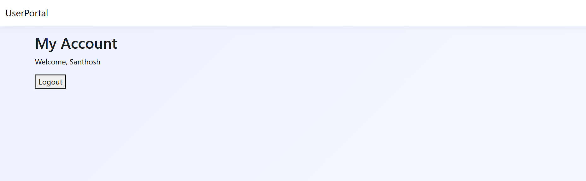

<!-- PROJECT BANNER -->
<p align="center">
  
</p>

<h1 align="center">UserPortal – ASP.NET Core MVC Authentication System</h1>

<p align="center">
  A clean, secure, and modern user authentication portal built using <b>ASP.NET Core MVC + Entity Framework Core + SQL Server</b>.  
  Designed with freshers, interviews, and real-world project structure in mind.
</p>

---

# 🌟 Features

✔ User Registration  
✔ Secure Login with BCrypt  
✔ Personalized Dashboard  
✔ Session-Based Authentication  
✔ EF Core Database Integration  
✔ Clean UI & Professional Layout  
✔ Fully responsive design  
✔ Best for fresher portfolios & interviews

---

# 🚀 Tech Stack

<p align="center">


</p>

---

# 🖼 Screenshots

### 🔹 Login Page


### 🔹 Register Page


### 🔹 My Account Page


---
## 🧱 Architecture Overview
                   +---------------------------+
                   |        UserPortal         |
                   +---------------------------+
                               |
    +----------------------------------------------------+
    |                      UI Layer                      |
    |        Views (Razor Pages: Login, Register)        |
    +----------------------------------------------------+
                               |
    +----------------------------------------------------+
    |                  Controllers Layer                 |
    |               AccountController.cs                 |
    +----------------------------------------------------+
                               |
    +----------------------------------------------------+
    |              Business Logic / Models               |
    |  User.cs | LoginViewModel.cs | RegisterViewModel   |
    +----------------------------------------------------+
                               |
    +----------------------------------------------------+
    |         Data Access Layer (Entity Framework)       |
    |               AppDbContext.cs (ORM)                |
    +----------------------------------------------------+
                               |
    +----------------------------------------------------+
    |               SQL Server Database                  |
    +----------------------------------------------------+


# 🗄 Database Structure

### 📌 Users Table Schema

| Column       | Type            | Description                          |
|--------------|-----------------|--------------------------------------|
| **Id**       | int (PK)        | Auto-increment primary key           |
| **FirstName**| nvarchar(100)   | User first name                      |
| **LastName** | nvarchar(100)   | User last name                       |
| **Phone**    | nvarchar(20)    | Mobile number                        |
| **Email**    | nvarchar(256)   | Login email (unique)                 |
| **Password** | nvarchar(max)   | BCrypt hashed password               |

### 🔐 Password Hashing

```csharp
BCrypt.Net.BCrypt.HashPassword(password);

// 🔎 Password Verification
BCrypt.Net.BCrypt.Verify(inputPassword, storedHash);
````
### 📁 Folder Structure

```

UserPortal/
│
├── Controllers/
│   └── AccountController.cs
│
├── Models/
│   ├── User.cs
│   ├── LoginViewModel.cs
│   ├── RegisterViewModel.cs
│   └── AppDbContext.cs
│
├── Views/
│   ├── Account/
│   │   ├── Login.cshtml
│   │   ├── Register.cshtml
│   │   └── MyAccount.cshtml
│   └── Shared/
│       ├── _Layout.cshtml
│       ├── _ViewImports.cshtml
│       └── _ViewStart.cshtml
│
├── Migrations/
│   └── (EF Core Migration Files)
│
├── wwwroot/
│   ├── css/
│   ├── js/
│   └── images/
│       └── logo.png
│
├── screenshots/
│   ├── UserPortal_login.png
│   ├── UserPortal_register.png
│   └── UserPortal_myaccount.png
│
├── appsettings.json
├── Program.cs
├── UserPortal.csproj
└── README.md
```


``
### 🔧 Setup Instructions

#### 1️⃣ Clone the Repo
```bash
git clone https://github.com/SanthoshDulam/UserPortal.git

````

### 2️⃣ Update SQL Connection

Inside **appsettings.json**:

```json
"ConnectionStrings": {
  "DefaultConnection": "Server=SANTHOSH\\SQLEXPRESS;Database=UserPortalDb;Trusted_Connection=True;TrustServerCertificate=True;"
}
```

### 3️⃣ Apply Migrations

```powershell
Update-Database
```

### 4️⃣ Run the Application

```bash
dotnet run
```

or press **IIS Express** in Visual Studio.

---

## 🔐 Password Hashing

### Hashing

```csharp
BCrypt.Net.BCrypt.HashPassword(password);
```

### Verification

```csharp
BCrypt.Net.BCrypt.Verify(inputPassword, storedHash);
```

---

## 🚀 Future Enhancements

* 🔹 Forgot Password (OTP)
* 🔹 Email Verification
* 🔹 Role-based Login (Admin/User)
* 🔹 Profile Settings & Picture Upload
* 🔹 Activity Logs
* 🔹 JWT / Cookie authentication upgrade

---

## ⭐ Author

**Dulam Santhosh Satya Sai Naga Hanuman**
Aspiring .NET Developer • Fresher
Passionate about backend development, SQL, and secure authentication systems.

---

## 🏁 Final Note

This project is built **from scratch** without using ASP.NET Identity —
showing strong understanding of:

✔ MVC architecture
✔ Sessions
✔ Database CRUD
✔ Password hashing
✔ UI design
✔ Real-world flow

